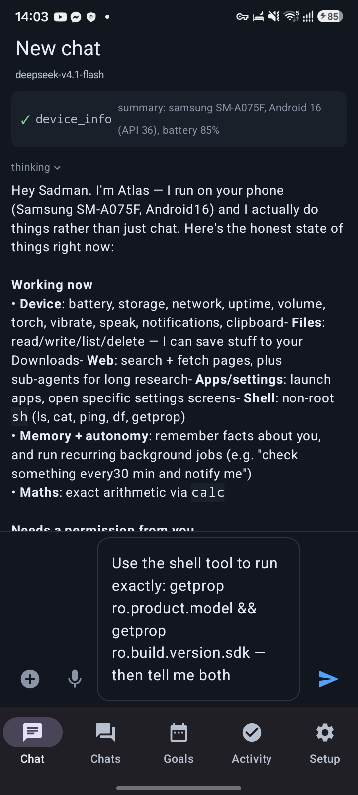
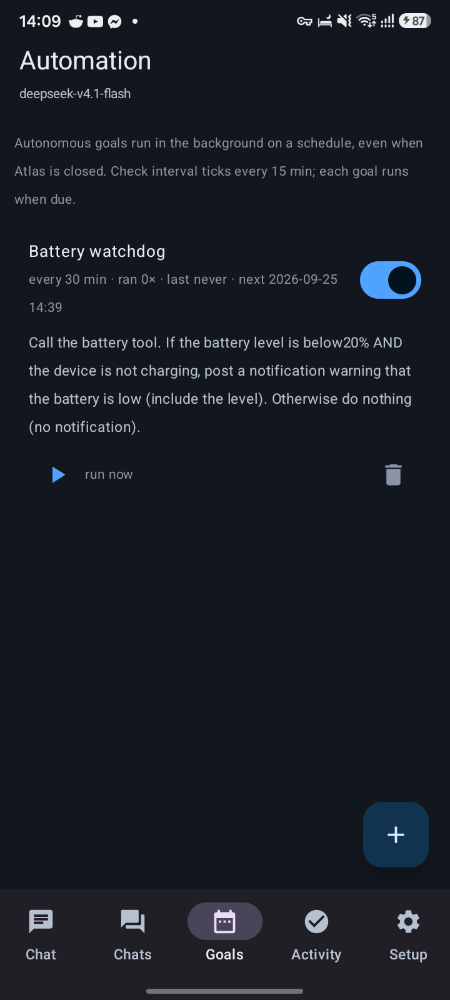
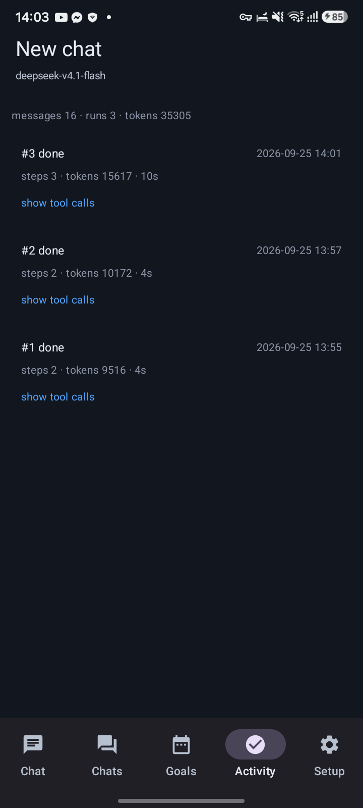
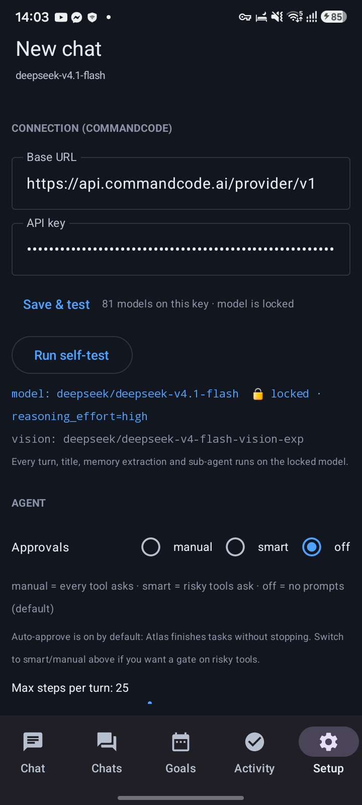

# Atlas

**A fully autonomous agent that lives on your Android phone.** Not a chat client — Atlas plans,
calls tools, drives the phone's UI, runs scheduled goals in the background, remembers facts, learns
skills and delegates work to sub-agents. Everything runs on-device, powered by the
[CommandCode](https://commandcode.ai) API.

<p align="center">
  
  
  
  
</p>

<p align="center"><em>Atlas on a Galaxy A07 (Android 16): live chat with tool chips · autonomous goals · run history · setup</em></p>

---

## Download

**[⬇︎ Get the APK](https://github.com/MdSadman2004/Atlas/releases/latest)** — `Atlas-1.0.0-debug.apk`, debug-signed, sideload it (Android 8.0+ / minSdk 26).
The same release carries the demo film `atlas-full-test-run.mp4` and the original score `atlas-score.wav`.

```bash
adb install -r Atlas-1.0.0-debug.apk          # or open the APK on the phone
```

---

## What makes it an agent, not a chatbot

| Capability | How it works |
|---|---|
| **49 built-in tools** | device & apps, files, web, shell, UI automation, memory, skills, goals, agent-internals |
| **Screen control** | an AccessibilityService gives Atlas the UI tree (`ui_dump`), taps by text (`ui_tap`), typing, swipes, system keys and screenshots — it can operate apps for you |
| **Vision** | `screenshot` → `analyze_image` (deepseek vision model) so it can actually *see* the screen |
| **Autonomy** | standing goals run on WorkManager schedules in the background (survive reboot/app death), one-off deferred tasks, notifications with results |
| **Memory** | durable facts injected into every prompt, plus automatic post-turn extraction |
| **Skills** | markdown skills with frontmatter, progressive disclosure, seeded with `atlas-self`, `phone-control`, `web-research` |
| **Sub-agents** | `spawn_agent` runs a nested agent loop in an isolated session and returns only its report |
| **Voice** | speech-to-text composer and text-to-speech replies |
| **Approvals** | `off` (default, auto-approve) · `smart` (risky tools ask) · `manual` (everything asks) |
| **Foreground service** | long runs survive leaving the app; live status notification with a Stop action |
| **Sessions & activity** | multiple conversations plus a run log with per-run steps, tokens, duration and every tool call |

## Verified on real hardware

Galaxy A07 (**SM-A075F, Android 16 / API 36**), live runs against the CommandCode API:

| run | tools executed | outcome |
|---|---|---|
| #2 | `now`, `battery` | *"Friday, 2026-09-25, 13:57 GMT+06:00 (Asia/Dhaka) — running on Samsung SM-A075F, Android 16. Battery 84%, not charging, 34.3 °C."* |
| #3 | `skill_read`, `device_info` | multi-step reasoning over the skill index and device state |
| goal tick | `battery` (autonomous) | goal *"Battery watchdog"* ran unattended, stayed silent as instructed, updated its own state |
| sub-agent | `calc` inside a nested run | `spawn_agent → 449.0` returned to the parent |

Emulator (Android 14) additionally proved: parallel tool calls in one step, the approval gate
pausing and resuming a run, `ui_dump` → `screenshot` → `analyze_image`, and a deferred
`schedule_once` task firing 2 minutes later with a notification.

## Architecture

Full write-up: **[docs/ARCHITECTURE.md](docs/ARCHITECTURE.md)** — runtime shape, the agent loop,
the CommandCode integration (endpoints, streaming, tool-call contract, vision), the SQLite data
model, autonomy scheduling, permissions and the verification log.

```
Compose UI ─► RunController ─► AgentEngine ─► LlmClient ─► CommandCode API
                    │              │
                    │              └─► 49 tools ─► Android APIs · AccessibilityService · WorkManager
                    └─► AgentService (foreground liveness) + SQLite (sessions, messages, goals, runs, events)
```

## Build

```bash
git clone https://github.com/MdSadman2004/Atlas.git && cd Atlas
export JAVA_HOME="/path/to/jdk-17"
./gradlew assembleDebug          # Gradle 8.9 · AGP 8.4.0 · Kotlin 2.0.21 · Compose BOM 2024.12.01
adb install -r app/build/outputs/apk/debug/app-debug.apk
```

## Install & first run

```bash
# optional: preload the API key + settings over ADB
ATLAS_KEY='<your-commandcode-key>' bash scripts/install.sh --key
```

1. **Setup → Connection** — verify the key (*Save & test* fetches the live model list).
2. **Grant phone permissions**, and **Enable screen control** if you want UI automation
   (Android → Accessibility → Atlas).
3. Optional: *Battery exemption* so scheduled goals are never deferred.

### Configuration defaults

* **Model is hard-locked** to `deepseek/deepseek-v4.1-flash` with `reasoning_effort: "high"`
  (deliberate: stored prefs can't switch it, setters are no-ops, the picker UI is gone).
* **Approvals default to `off`** — auto-approve; Atlas finishes its work without stopping.
* **Vision** uses `deepseek/deepseek-v4-flash-vision-exp`.
* Autonomy ticks every 15 min by default; each goal has its own interval (15–720 min).

### Hands-free driving (automation / testing)

```bash
adb shell "am start -a android.intent.action.SEND -t 'text/plain' --ez autosend true \
  --es android.intent.extra.TEXT 'call the battery tool and tell me the level' \
  -n com.atlas.agent/.ui.MainActivity"
```

`autosend=true` submits the prompt immediately — no taps. Progress is visible in
`adb logcat -d -s Atlas:*` (`run#N start/end`, `llm: chars=… tools=… tokens=…`, `tool <name> ok=…`).

## API facts (probed, not guessed)

* `POST /chat/completions` + `tools` → real `tool_calls`, also inside streaming deltas,
  `finish_reason: "tool_calls"`; deltas carry `reasoning`; `usage` lands on the final chunks.
* `GET /models` is public: 81 models; only `claude-*` uses `/messages` (Anthropic protocol) and is
  plan-gated on this account.
* Vision accepts `image_url` data-URIs.

## Repo layout

```
app/src/main/java/com/atlas/agent/
├── core/agent/    AgentEngine, RunController, ApprovalHub, system prompt
├── core/llm/      LlmClient (OpenAI + Anthropic SSE), models
├── core/tools/    49 tools (device, apps, files, web, shell, ui, memory, skills, goals, agent)
├── core/a11y/     AtlasA11yService — UI tree, gestures, screenshots
├── core/autonomy/ GoalScheduler, workers, boot receiver
├── core/store/    AtlasDb (SQLite), Settings
├── core/voice/    SpeechRecognizer + TextToSpeech
└── ui/            Compose screens (Chat, Sessions, Goals, Activity, Setup, Tools, Memory, Skills)
scripts/           install.sh (install + key injection), emulator-up.sh, see.py (vision)
docs/              ARCHITECTURE.md + screenshots
```

## License

MIT — see [LICENSE](LICENSE).
